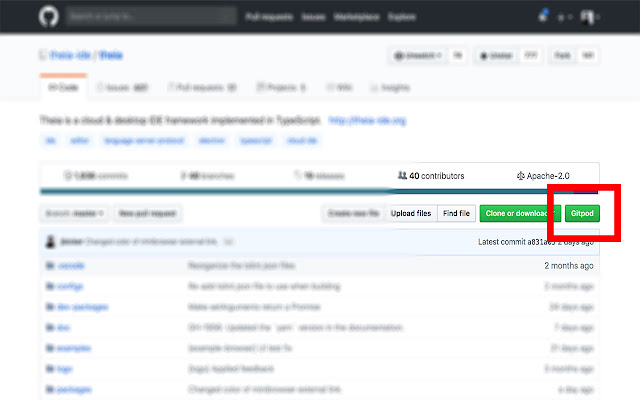
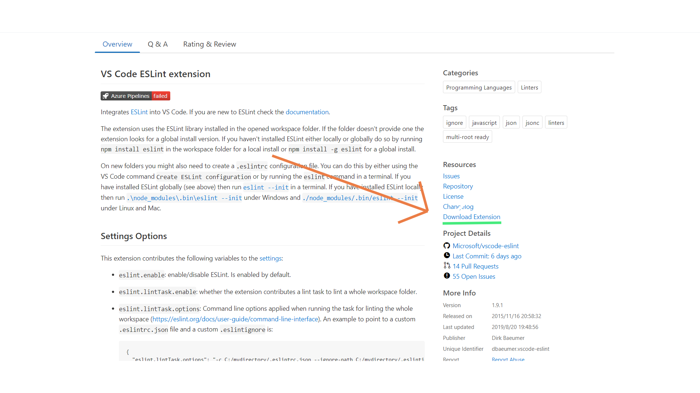

# [Gitpod](https://www.gitpod.io/)って何？

> One-Click Online IDE for GitHub & GitLab

[GitHub](https://github.com/),[GitLab](https://gitlab.com/)のためのワンクリックオンライン IDE です。

GitHub や GitLab のページからすぐに使える使い捨ての VS Code ライクなクラウド開発環境を構築してくれます。

[Theia](https://theia-ide.org/)というオープンソースの IDE を動かしています、詳しくは Theia のサイトを見てみてください。

# なんで最強なのか

- 無料（50 時間/月、オープンソース）
- アカウント連携だけで利用できる (GitHub,GitLab,Bitbucket)
- 開発環境を使い捨てできる
- VS Code と操作感が同じ（拡張機能も対応）
- 自動で開発環境をセットアップできる
- コラボレーション（ペアプロ）ができる
- Git 統合されていて Pushは勿論のことGitHubなどのPRレビューまでできる
- 多くのプログラム言語をサポート
- ターミナルが利用できる
- タブレットやスマホでも利用できる（現在調整中）

# 使い方

`gitpod.io/#`を GitHub,GitLab,Bitbucket のリポジトリURLの先頭につけるだけ

これだけで開発を開始できます！
(URLがIssuesだと新ブランチが作られた状態で、Pull Requestだとレビュー画面で起動するなどちょっとした小技があります)

また、[Chrome 拡張機能](https://chrome.google.com/webstore/detail/gitpod-online-ide/dodmmooeoklaejobgleioelladacbeki)をインストールし簡単にアクセスできるようにする方法もあります。（オススメ）



https://www.gitpod.io/docs/10_getting_started/

# Gitpod をより便利にする方法

## .gitpod.yml を設定する

- DockerFile を利用できる
- モジュール等を起動時にインストールできる

といった他の IDE では手の届かないところが使えます。

例:

```yml
# ワークスペースを実行するDockerイメージ デフォルト:gitpod/workspace-full
image: <your-workspace-image>

# 起動時に実行するコマンド
tasks:
  - init: yarn install
    command: yarn start
# 起動時に開くポート
ports:
  - port: 8000
    onOpen: open-preview
```

これで起動時に`localhost:8000`のプレビューが開いた状況を自動で用意します。

https://www.gitpod.io/docs/41_config_gitpod_file/

## GitHub アプリを利用する

GitHub アプリを利用することで継続的インテグレーション（CI）のように自動でリポジトリの変更を検出しワークスペースを準備し始めます、起動を始める前に起動処理が終わるので少し時間のかかる起動時間が大幅に減ります。

[こちら](https://github.com/marketplace/gitpod-io)からセットアップ！

## VS Code 拡張機能をインストールする

左側の拡張機能欄から検索してインストールします。

以下の動画を参考にしてみてください。
[](http://www.youtube.com/watch?v=eD_GQ2lQug8)

<details>
<summary>いつもの拡張機能がない場合</summary>

GitpodではMicrosoftの規約の影響によりVSCode Marketplaceではなく[Open VSX](https://open-vsx.org/)を利用しているので検索しても思ってる拡張機能が出ないことがあります。

[VSCode Marketplace](https://marketplace.visualstudio.com/vscode)から拡張機能をダウンロードしてください、そのファイルをGitpodにドラッグアンドドロップすると利用できます。



わかりにくいですがMarketplaceの右側にある`Download Extension`からインストールしてください。

</details>

詳細:https://www.gitpod.io/docs/vscode-extensions/

## 環境変数を設定する

```
gp env foo=bar
```

とコマンドに打ち込む
または[ダッシュボード](https://gitpod.io/environment-variables/)から設定できます。

https://www.gitpod.io/docs/47_environment_variables/

# 終わりに

2019年4月、βから本公開に移ったときこの記事を書かせてもらいました。
その後7月からGitpodに関わらせて頂いています。感謝🙇

追記:Gitpodの良さをもっと知ってもらうために記事を書いています、この記事に付け足すか新しく記事を作るかは未定ですが楽しみにしていてください(2020/09/10)

Gitpodに関してわからないことがあれば気軽に聞いてください、多くの人に必要そうな内容であれば追記させていただきます。

※指摘、質問があればコメント又は[Twitter](https://twitter.com/mouse_484)までお願いします。
