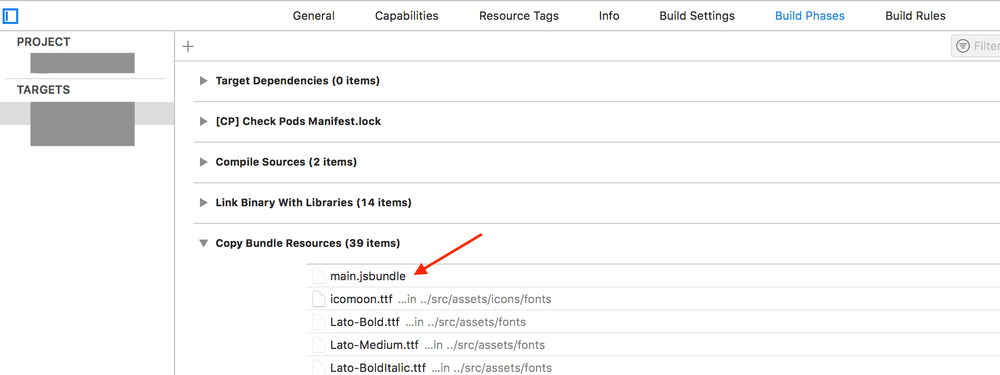

```log:error
File /.../Xcode/DerivedData/.../Build/Products/Release-iphoneos/.../main.jsbundle does not exist. This must be a bug with
```

- npm scriptにある`build:ios`を実行して`main.jsbundle`を再生成する。
  - なければ
  - ```sh
    react-native bundle --entry-file='index.js' --bundle-output='./ios/main.jsbundle' --dev=false --platform='ios'
    ```
- XCode側のビルド設定に追加する
  - `Build Phases`->`Copy Bundle Resource`
    - 追加画面の一覧にないので左下の`Add Other…`から`/ios/main.jsbundle`を追加



---

https://stackoverflow.com/questions/49505446/main-jsbundle-does-not-exist-this-must-be-a-bug-with-echo-react-native
