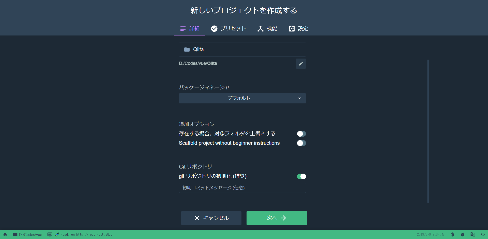
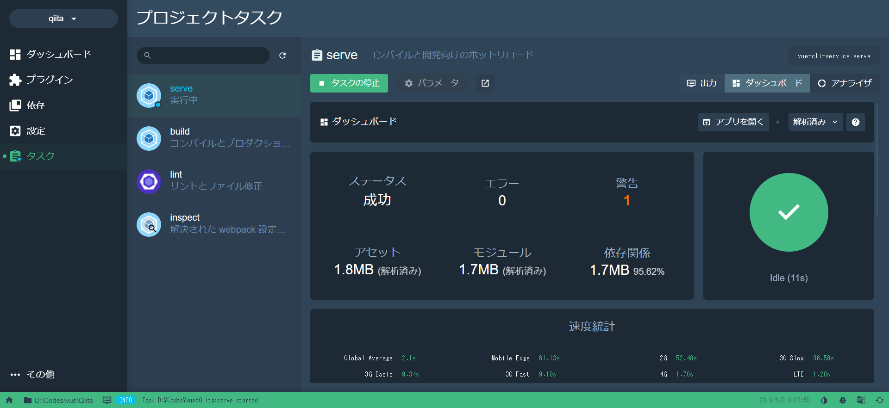

# はじめに

Vue.js をこれから勉強しようとしている方、初心者の方が見ていると思います。<br>
自分が途中まで学習して躓いた点を中心に書いているので読んでいただけたら嬉しいです。<br>
Vue.js つよつよエンジニアさんは優しい気持ちで見ててください。<br>

Vue使えるようになった今考えると[Nuxt.js](https://ja.nuxtjs.org/)を使ったほうが簡単かもしれません (2019/11/05追記)

# 1.Vue のインストールなど

※この先 Node.js(&npm)がインストールされていることを前提に話を進めます、まだインストールが済んでいなければ[公式サイト](https://nodejs.org/ja/)からインストールしてから進めてください。

## Vue-cli のインストール

vue-cli は vue を開発する上で便利な物が詰まっています。
適当にフォルダを作成し、その中で下のように入力してください。

```
npm install -g @vue/cli
```

容量が結構あるので少し時間かかるかもしれません。

## Vue プロジェクトの作成

cli が入ったと思うのでコマンドでプロジェクトを作成します、とよくあるサイトや記事では書いてあると思いますが初心者には難しいと思います。UI でやりましょう。

```
vue ui
```

と入力してください。<br>
`Vue プロジェクトマネージャー`というのがブラウザで起動したと思います。
真ん中にある`作成`->`ここにプロジェクトを作成する`を順に押し

このようなページになれば OK です、プロジェクトフォルダに名前を入れて次に進んでください。
次も特に設定する必要は無いのでデフォルトを選んで作成に進んでください。少し時間かかります。

これで Vue プロジェクトの作成は終わりです。

# Vue の実行

まだ UI を使います、左のタスクを選択してください。
`serve`の下にあるタスクの実行をして少し待ってください。


画像のように右の丸にチェックマークがついたら完了です。

アプリを開くを押せばあなたの最初の Vue のページが表示されます。

# Vue の編集

ではあなたが作成した Vue のフォルダを見てください。
`src`というフォルダを見つけれましたか？

その中が私達がメインに編集しサイトなどの内容物を作成するものです。

## App.vue

このファイルを見つけたら開いて見ましょう。

Vue.js のメインのファイルです。HTML でサイトを作った人ならわかると思いますが index.html に当たります。（本当の index.html は public フォルダにあります）

３つの大きな塊があると思います。
`template`/`script`/`style`の３つです、HTML の経験ある人はだいたい分かると思いますが`template`は body に当たります。

では編集していきましょう。

```vue
<HelloWorld msg="Welcome to Your Vue.js App" />
```

msg=の後ろを好きに変更してください。

先程開いたページを見ると変更した内容に変わっていると思います。

## HelloWorld.vue

`component`フォルダにあります。
こちらも先程と同じで３つの塊がありますね。

説明はあまりないので書き換えて行きましょう。
`template`の`div`中は書き換えても問題起きないので好きに変えてください。

ページを見て思ってたように出たら完成です。

# おわりに

初心者が初心者なりにいくつかの問題を踏まえて書かせていただきました。
今回は簡単にするために v-系の説明等は省かせていただきました。

参考 : [Vue.js 公式サイト](https://jp.vuejs.org/index.html)
